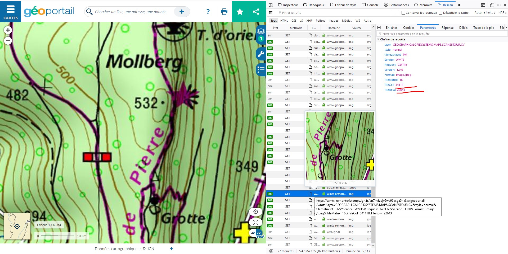

Give it a url and some coordinates and it will download the map you want.
You can use it on websites like geoportail.

## Example

Edit `fetch_row.py` to fill in required parameters.

```
# Download 5x5 tiles starting from tile at (34133, 22633)
$ python download_tiled_map.py 34133 22633 5 5
```

Your map is now available in `map.jpeg`. 
Be sure to delete the folder `cached` which containes all tiles once done.

### How to know the coordinates of my map ?

For example on the website géoportail, open your web browser developper tools and take a look at the web requests.


  
